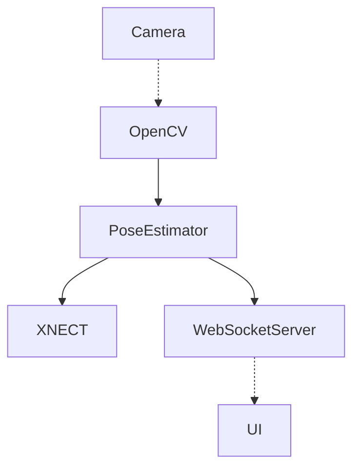
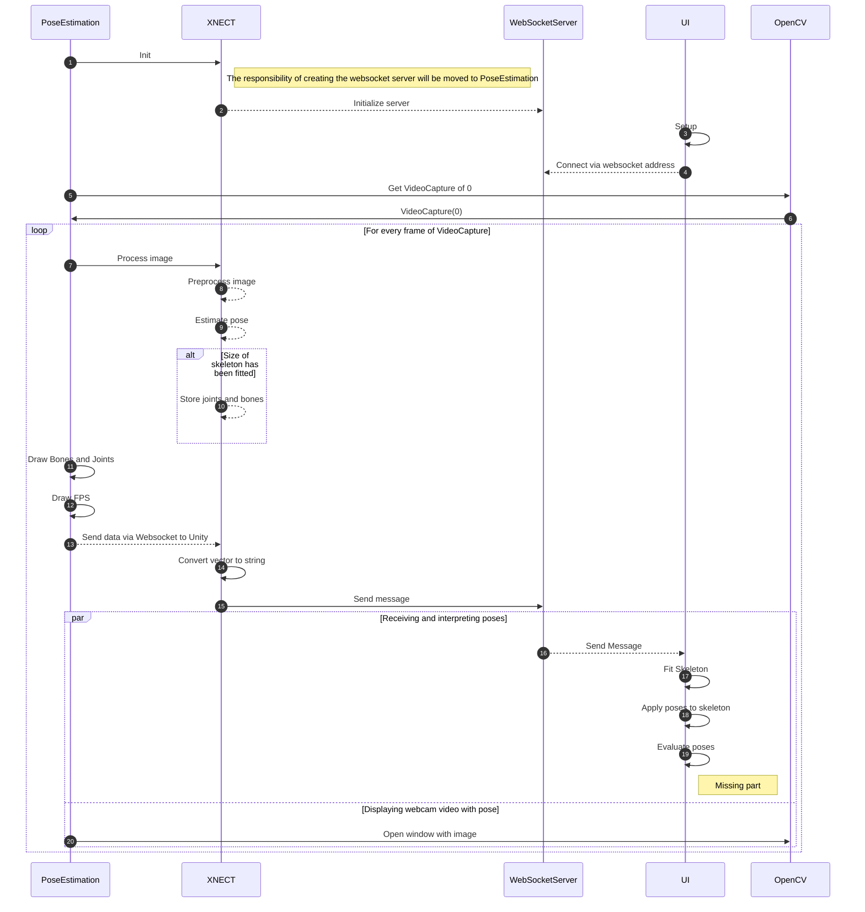

# Architecture

The architecture is containing the following components:

- `PoseEstimation`: The pose estimation service
- `fimi`: The UI application

These two components are combined by using the WebSockets protocol to transfer raw data from the pose estimation service to the application.



The application flow for a live mode is sketched as the following:



To work and test the UI independently from XNECT, I have set up a mock recorder and a mock player inside of `PoseEstimation`. The mock recorder records the pose data that has been sent to Unity including a delay and stores the data into a `.mock` file which looks like this:

```
229.000000
25.000000 
25.000000 
23.000000 
24.000000 
24.000000 
30.000000 
24.000000 
25.000000 
24.000000 
25.000000 
25.000000 
25.000000 
26.000000 
27.000000 
26.000000 
26.000000 1, 0, 0, 121.944, 72.0927, 2594.74, 89.589, 314.064, 2555.61, 56.7924, 553.93, 2505.45, 45.4224, 640.873, 2499.97, 23.1571, 801.152, 2457.04, -112.408, 528.866, 2517.62, -276.337, 299.179, 2568.88, -422.833, 43.1705, 2572.49, -469.715, -49.8809, 2578.17, -5.41108, 54.5817, 2586.84, -53.0617, -450.547, 2670.59, -94.3325, -885.489, 2741.48, -190.486, -845.551, 2540.89, 227.182, 567.201, 2491.45, 447.561, 385.065, 2468.72, 656.988, 186.733, 2416.86, 734.317, 117.025, 2409.8, 248.266, 96.3249, 2601.39, 372.512, -398.048, 2669.2, 480.016, -823.715, 2725.35, 552.487, -794.181, 2513.33
26.000000 1, 0, 0, 123.388, 70.7169, 2594.52, 90.3155, 312.658, 2555.81, 56.7142, 552.499, 2506.06, 45.1935, 639.431, 2500.72, 22.2834, 798.938, 2455.32, -112.314, 527.257, 2520.1, -280.78, 302.869, 2579.48, -434.402, 51.3321, 2591.46, -483.709, -40.2425, 2599.93, -4.0593, 53.1267, 2588.48, -49.5482, -452.067, 2673.04, -89.1051, -887.091, 2744.41, -198.21, -845.181, 2550.97, 226.924, 565.95, 2490.17, 451.245, 389.116, 2464.34, 664.697, 195.931, 2409.54, 743.559, 128.084, 2401.41, 249.778, 95.0272, 2599.31, 371.103, -400.325, 2665.23, 476.215, -826.838, 2719.47, 550.716, -780.497, 2511.19
26.000000 1, 0, 0, 127.882, 68.6626, 2610.79, 92.6836, 307.249, 2556.33, 56.8491, 542.998, 2491.02, 44.7519, 629.315, 2479.99, 20.0619, 784.346, 2421.82, -111.751, 518.05, 2509.9, -298.589, 313.208, 2583.31, -474.712, 76.6756, 2590.18, -532.353, -10.0433, 2596.98, 0.396675, 50.3765, 2609.54, -48.7316, -447.073, 2730.25, -91.5959, -875.528, 2832.68, -217.325, -841.504, 2647.98, 226.661, 556.061, 2471.07, 460.311, 397.329, 2421.38, 679.788, 221.438, 2339.06, 762.03, 159.884, 2320.72, 254.248, 93.5635, 2610.36, 379.253, -395.849, 2706.75, 487.668, -817.452, 2786.75, 563.72, -782.071, 2576.89
26.000000 1, 0, 0, 133.971, 56.8954, 2621.2, 97.4878, 293.025, 2557.65, 60.3404, 525.893, 2483.35, 47.8248, 611.662, 2469.01, 22.1783, 763.996, 2404.48, -108.059, 501.021, 2504.03, -301.528, 303.351, 2579.88, -485.578, 72.8409, 2577.65, -546.235, -11.9912, 2581.27, 6.55404, 38.0993, 2621.48, -49.2565, -453.41, 2761.99, -98.0443, -876.831, 2881.31, -230.808, -845.296, 2701.16, 229.998, 538.852, 2462.05, 465.842, 385.491, 2406.24, 686.562, 214.016, 2318.13, 769.642, 154.327, 2297.55, 260.232, 82.231, 2619, 384.562, -403.417, 2733.57, 492.791, -822.036, 2828.16, 573.028, -792.276, 2618.99
26.000000 1, 0, 0, 138.708, 19.4843, 2634.96, 98.3392, 251.957, 2561.11, 57.2527, 480.67, 2476.67, 43.69, 565.558, 2458.54, 14.8221, 713.146, 2384.97, -110.243, 455.912, 2503.82, -324.589, 304.317, 2619.28, -539.039, 115.319, 2692.12, -610.247, 45.1712, 2722.08, 11.5441, 1.01303, 2643.72, -56.3276, -479.26, 2814.51, -115.734, -893.067, 2959.9, -262.905, -861.993, 2791.23, 226.071, 493.508, 2449.46, 477.511, 371.579, 2384.89, 716.88, 228.754, 2294.41, 806.782, 180.438, 2272.68, 264.598, 44.3849, 2624, 404.886, -432.998, 2753.87, 528.26, -845.563, 2856.2, 601.454, -818.891, 2644.04
25.000000 1, 0, 0, 140.989, -30.9063, 2648.33, 98.3033, 199.418, 2569.23, 54.7289, 425.69, 2479.62, 40.4718, 510.022, 2459.54, 9.52918, 654.463, 2380.75, -112.158, 400.967, 2510.32, -330.734, 265.551, 2637.38, -552.58, 91.7731, 2724.56, -626.443, 26.8917, 2759.53, 14.0809, -49.6537, 2659.79, -60.5736, -523.646, 2844.72, -126.242, -932.205, 3001.79, -273.74, -901.719, 2833.29, 222.991, 438.499, 2449.15, 478.838, 329.16, 2379.54, 725.932, 198.751, 2291.1, 818.501, 155.469, 2269.97, 266.557, -5.79375, 2634.52, 413.728, -479.523, 2770.02, 547.723, -891.449, 2860.94, 619.485, -857.385, 2649.36
27.000000 1, 0, 0, 144.502, -58.6158, 2673.35, 99.7548, 169.644, 2589.55, 53.898, 393.552, 2495.26, 39.0478, 477.335, 2473.39, 6.14265, 619.007, 2390.48, -112.302, 369.263, 2529.79, -347.775, 260.748, 2652.41, -590.302, 114.049, 2734.1, -672.011, 58.2582, 2767.27, 17.8727, -77.3901, 2687.53, -70.0352, -543.526, 2886.1, -148.235, -945.704, 3053.55, -294.25, -913.604, 2884.06, 221.506, 405.939, 2461.22, 481.273, 310.429, 2386.01, 734.856, 193.862, 2296.61, 829.683, 156.064, 2274.98, 269.731, -33.5378, 2656.7, 420.653, -506.101, 2792.15, 565.431, -919.812, 2853.68, 630.779, -871.444, 2642.8
26.000000 1, 0, 0, 153.773, -78.0278, 2720.54, 105.261, 145.588, 2626.89, 55.4936, 364.305, 2522.9, 39.4206, 446.809, 2497.34, 3.80299, 584.149, 2408.48, -109.809, 340.19, 2561.61, -357.3, 247.969, 2673.42, -612.266, 117.294, 2743.64, -698.85, 66.9951, 2773, 27.6244, -97.1785, 2738.1, -64.5657, -551.326, 2961.02, -149.089, -944.298, 3146.3, -293.414, -916.989, 2974.54, 222.331, 376.569, 2485.22, 487.352, 301.122, 2405.67, 747.788, 203.636, 2313.18, 844.984, 173.449, 2290.15, 278.414, -52.7107, 2700.24, 431.986, -525.681, 2831.21, 579.048, -939.788, 2884.04, 639.156, -888.086, 2672.4
27.000000 1, 0, 0, 164.971, -92.603, 2778.45, 114.621, 125.626, 2673.72, 62.9655, 338.295, 2558.69, 46.1352, 419.234, 2528.96, 9.98962, 551.661, 2433.12, -102.209, 314.45, 2598.11, -355.739, 236.419, 2707.15, -617.19, 118.544, 2776.17, -706.338, 72.8344, 2805.36, 38.8728, -112.766, 2795.22, -61.8639, -554.631, 3038.21, -161.022, -940.567, 3230.89, -295.563, -916.75, 3050.87, 229.793, 350.373, 2520.9, 498.073, 289.4, 2439.88, 762.985, 205.513, 2346.77, 861.615, 180.882, 2323.23, 289.514, -66.4322, 2758.63, 437.102, -549.665, 2854.25, 579.013, -968.311, 2876.61, 639.514, -901.449, 2669.37
25.000000 1, 0, 0, 171.638, -87.0728, 2841.48, 119.25, 119.844, 2716.7, 65.3374, 319.847, 2581.72, 47.4349, 397.325, 2544.37, 11.8114, 520.32, 2436.52, -99.9346, 296.43, 2620.99, -358.204, 228.28, 2725.44, -622.978, 117.295, 2793.2, -713.521, 74.4116, 2822.38, 45.6466, -111.53, 2852.27, -57.0528, -536.92, 3122.34, -175.466, -921.006, 3307.7, -288.03, -900.928, 3112.76, 232.459, 331.735, 2545.2, 502.325, 278.037, 2464.29, 769.365, 199.782, 2372.37, 868.663, 178.174, 2348.66, 296.028, -56.9406, 2827.07, 436.09, -551.47, 2843.29, 572.056, -970.817, 2803.73, 640.148, -873.414, 2611.5
27.000000 1, 0, 0, 171.899, -89.0377, 2898.82, 120.891, 105.027, 2754.37, 68.6302, 289.632, 2598.43, 50.7726, 362.67, 2552.99, 21.4377, 475.909, 2433.22, -97.6004, 266.438, 2633.56, -367.042, 206.393, 2711.36, -639.046, 101.029, 2755.25, -732.818, 60.5165, 2776.57, 46.5699, -118.54, 2902.1, -62.9598, -529.873, 3190.63, -189.245, -910.723, 3377.47, -276.869, -902.461, 3169.31, 236.816, 301.664, 2567.23, 509.706, 262.864, 2487.96, 781.771, 198.515, 2400.07, 882.379, 182.98, 2377.15, 295.68, -54.2351, 2891.37, 410.566, -544.848, 2788.7, 523.437, -953.17, 2660.5, 603.418, -820.724, 2495.76
25.000000 1, 0, 0, 176.585, -90.7511, 2938.37, 128.033, 97.3993, 2785.49, 79.6956, 272.168, 2617.42, 62.4552, 342.225, 2567.29, 42.197, 451.857, 2442.4, -87.5676, 245.726, 2644.42, -360.883, 189.828, 2710.99, -635.116, 87.1719, 2746.65, -729.982, 47.9293, 2765.34, 52.635, -125.447, 2933.77, -61.2719, -545.194, 3208.14, -185.516, -932.792, 3382.02, -254.02, -926.799, 3166.73, 248.994, 287.726, 2595.04, 522.832, 252.572, 2517.36, 796.329, 191.095, 2431.9, 897.267, 177.086, 2409.44, 299.07, -50.9278, 2938.56, 406.953, -538.021, 2813.9, 515.27, -943.354, 2672.91, 615.559, -806.291, 2523.81
26.000000 1, 0, 0, 182.097, -93.5319, 2978.61, 133.067, 77.2144, 2806.65, 86.7544, 229.94, 2617.82, 69.2463, 293.134, 2559.35, 53.1408, 390.64, 2424.22, -80.3631, 197.29, 2638.08, -363.956, 173.633, 2673.76, -649.608, 100.766, 2684.12, -749.555, 72.5706, 2694.34, 60.3512, -134.891, 2971.13, -48.6047, -561.843, 3236.24, -165.457, -956.219, 3399.69, -222.306, -950.333, 3181.03, 256.148, 252.396, 2603.45, 531.948, 238.1, 2526.07, 810.433, 197.379, 2444.39, 912.272, 191.952, 2422.3, 302.379, -47.5487, 2981.16, 418.184, -542.651, 2904.33, 526.159, -963.797, 2821.38, 636.781, -847.83, 2662.03
26.000000 1, 0, 0, 186.253, -84.8339, 3023.66, 141.483, 60.3919, 2828.64, 101.717, 183.066, 2617.69, 85.748, 236.66, 2549.94, 74.4023, 314.74, 2402.28, -65.2093, 147.059, 2633.31, -351.72, 141.045, 2621.78, -639.334, 83.353, 2590.73, -741.242, 61.2901, 2586.63, 65.9624, -130.293, 3016.43, -47.9044, -581.977, 3234.27, -167.903, -990.502, 3355.15, -220.252, -962.806, 3137.05, 270.883, 209.908, 2609.48, 539.077, 200.919, 2508.25, 811.473, 164.695, 2406.4, 911.027, 162.081, 2375.24, 305.207, -35.4815, 3025.33, 424.743, -527.562, 2935.84, 537.645, -944.269, 2838.31, 646.481, -821.846, 2682.61
```

A line is separated into a delay (the first decimal number) and the pose estimation (after a ` ` space). The first lines of the `.mock` file shows the frames XNECT has taken to fit a skeleton to the given person.

The mock player takes this file, interprets it line by line and sends the given pose data after the delay via `WebSocketServer` to Unity. The mock player sends this data in a loop while being active.

The result looks like the following video:

[3dpose.mp4](3dpose.mp4 ':include :type=video controls')