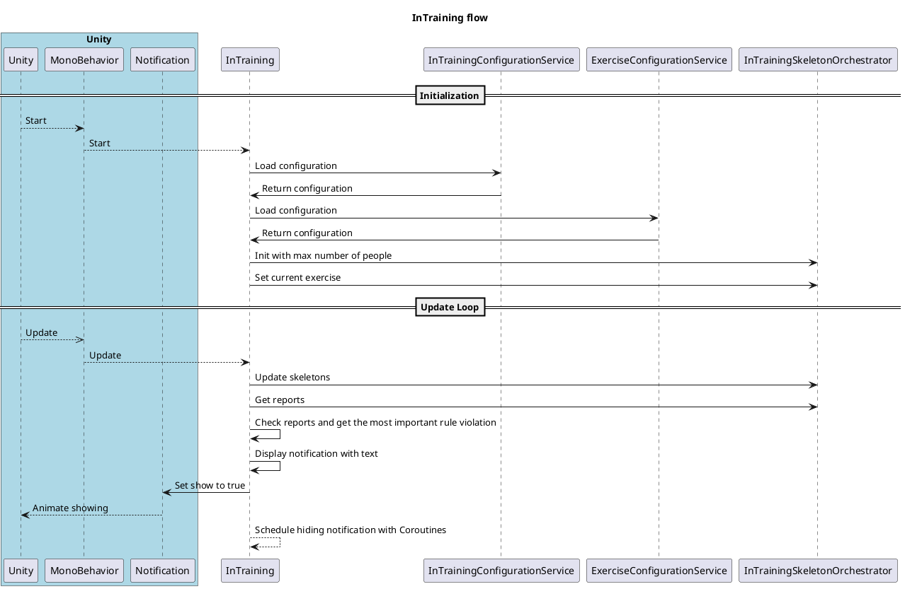

# In-Training
Defined as the user state in which the user is performing a set of exercises to a specified training. For each exercise, [Pre-Exercise](pre-exercise.md), [In-Exercise](in-exercise.md) and [Post-Exercise](post-exercise.md) are the dedicated user interfaces. The In-Training scene contains the detected skeletons and a notification UI panel to show and trigger noting wrong movements and body forms of the trainee.

The current app flow is sketched in the following sequence diagram:


## User Interface
During In-Training, the application is connecting to the pose estimation Web Socket server to retrieve the data. It displays the skeletons, colorizes the bones accordingly to the [pose evaluation](pose-evaluation/pose-evaluation.md) and shows notifications to the user about rule violations.

[_media/inTraining-UI.mp4](_media/inTraining-UI.mp4 ':include :type=video controls')

### Configuration
Some of the user interface settings can be configured in the `InTraining.yaml` configuration file.

Example configuration:

```yaml
showNotificationDurationInSeconds: 3
```

**Parameters:**
- `showNotificationDurationInSeconds`: The seconds until a notification will be dismissed.