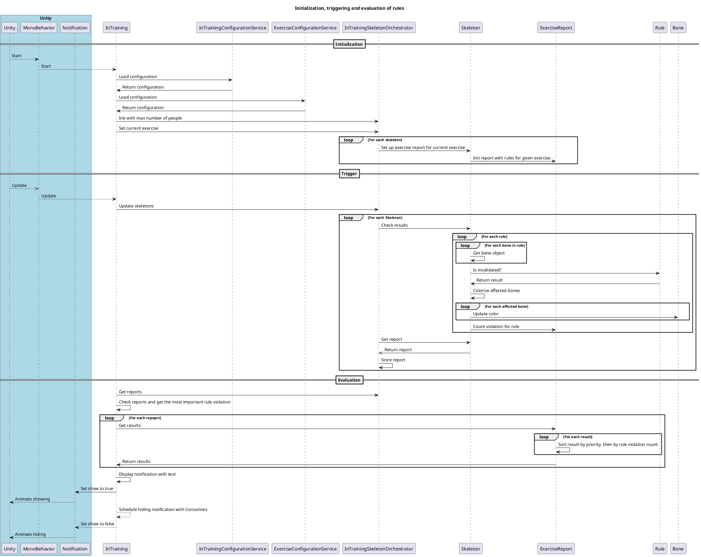

# Rule based pose evaluation

The evaluation of the body form and movement is based on the rules written in [Squat-Arm-Raise exercise](../../../introduction/exercises/squat-arm-raise.md) and is triggered on `Update()` Mono behavior of Unity. 

Below is the sequence diagram of how rules are initiated, triggered and evaluated:


## Configuration
fimi is using YAML as a format for defining and checking the different exercises and their applied different rules.

An example configuration:

```yaml
exercises:
  - type: squatArmRaise
    rules:
    - !rangeOfMotionRule
      notificationText: "Don't overstretch your knees"
      colorize: true
      priority: 10
      lowerThreshold: 0
      upperThreshold: 95
      bones:
        - LeftLowerLeg
        - LeftThigh
    - !rangeOfMotionRule
      notificationText: "Don't overstretch your knees"
      colorize: true
      priority: 10
      lowerThreshold: 0
      upperThreshold: 95
      bones:
        - RightLowerLeg
        - RightThigh
    - !verticallyRule
      notificationText: "Keep your head, neck and body vertical"
      colorize: true
      priority: 10
      tolerance: 10
      bones:
        - LowerBody
        - UpperBody
        - Neck
        - Head
- !symmetryRule
```

### Parameters
- `exercises`: List of named exercises, containing following fields:
	- `type`: The type of the exercise (defined in `ExerciseType.cs`. Currently, `SQUAT_ARM_RAISE` is the only parameter to be set.
	- `rules`: A list of rules for checking the performed exercise

### Rules
Every rule is defined by it's type as a tag (leading with a `!`) and it's dedicated parameters. The following parameters are shared among all rules and can be set for each rule individually:
- `priority`: An `int` that can be used for influencing the sorting and showing of notifications. The higher, the more prioritized.
- `colorize`: A `bool` that declares if you want to colorize the bones as well in case of violation. The colorization differs between the rules.
- `notificationText`: A `string` that contains the message shown to the user when this rule is violated and selected to be shown.

The following rule types are supported:
- `angleRule`:
- `rangeOfMotionRule`
- `verticallyRule`
- `horizontallyRule`
- `linearityRule`
- `symmetryRule`
- `speedRule` 

#### Angle rule
An angle rule is considered as a rule that checks if two bones are in a specified angle to each other. The smallest angle is used for consideration and the angle itself cannot be more than 180 degrees. The value itself is ranging between 0 and 180 degrees.

**Parameters:**
- `expectedAngle`: The ideal angle to reach.
- `lowerTolerance`: The lower tolerance range the angle between the bones can reach. 
- `higherTolerance`: The higher tolerance range.
- `bones`: The bones to be checked with this rule. Currently, exactly two bones must be given.

Example for the lower and higher tolerance usage: a `lowerTolerance: 5` of the `expectedAngle: 90` would consider an angle of 84 degrees as invalidation of the rule.


#### Range of motion rule
This rule can be used to notify the user if they are moving two bones outside of a specified range of motion (like over-flexing the thighs and lower knees).

**Parameters:**
- `lowerThreshold`: the lower threshold of the range.
- `higherThreshold`: the higher threshold of the range.
- `bones`: The bones to be checked with this rule. Currently, exactly two bones must be given.

It's similar to `Angle rule` but can lead to different user notifications (like marking specified bones as red / neutral color instead of red / green).

#### Vertically Rule
Bones are vertical if they are parallel to either the `y` or the `z` axis. To determine the violation of the rule, angles between a reference vector and the given bones are calculated and summed up. If the value is inside of the `-tolerance`-`tolerance range, the rule is not violated.

**Parameters:**
- `bones`: The bones to be checked with this rule.
- `tolerance`: The accepted sum of deviation of differences to the `y` or `z` axis.

#### Horizontally Rule
Bones are horizontal if they are parallel to the `x`-`z` plane. To determine if the rule is violated, angles between each bone and the `x`-`z` plane are calculated, summed up and compared with the `tolerance` value. If they are inside of the `-tolerance`-`tolerance` range, all bones are considered as horizontal.

**Parameters:**
- `bones`: The bones to be checked with this rule.
- `tolerance`: The accepted sum of deviation of differences to the `x`-`z` plane.

#### Linearity Rule
Bones are linear to each other if the angle between them is 0 degree. The angles between all given bones are calculated, summed up and compared to the `-tolerance`-`tolerance` range.

**Parameters:**
- `bones`: The bones to be checked with this rule.
- `tolerance`: The accepted angle degree deviation.

#### Symmetry Rule
Two sets of bones (`leftBones` and `rightBones`) are considered as symmetrical, if the summed distance of them is inside of the `-tolerance`-`tolerance` range when flipping one of the sets around a reference bone (`centerBone`).

**Parameters:**
- `leftBones`: The bones to be checked with this rule.
- `rightBones`: The bones that should be matched with.
- `centerBone`: The reference bone that is used to flip the bones.
- `tolerance`: The accepted deviation of all angle differences to the `y` or `z` axis of all bones (if the bones are slightly bended.

#### Speed Rule
Speed is considered as a distance change between two timestamps. A set of `bones` is thus considered as being moved appropriately, if the summed distance per bone between two timestamps is inside of the `lowerDistanceChangeThreshold` and the `upperDistanceChangeThreshold`.  

!> This rule is highly depending on the `Update()` rate of Unity. It might make sense to change the rule to a consistent check rate 

**Parameters:**
- `bones`: The bones to be checked with this rule.
- `upperDistanceChangeThreshold`: The upper distance change limit. Useful to declare a movement as too fast.
- `lowerDistanceChangeThreshold`: The lower distance change limit. Useful to declare a movement as too slow.
