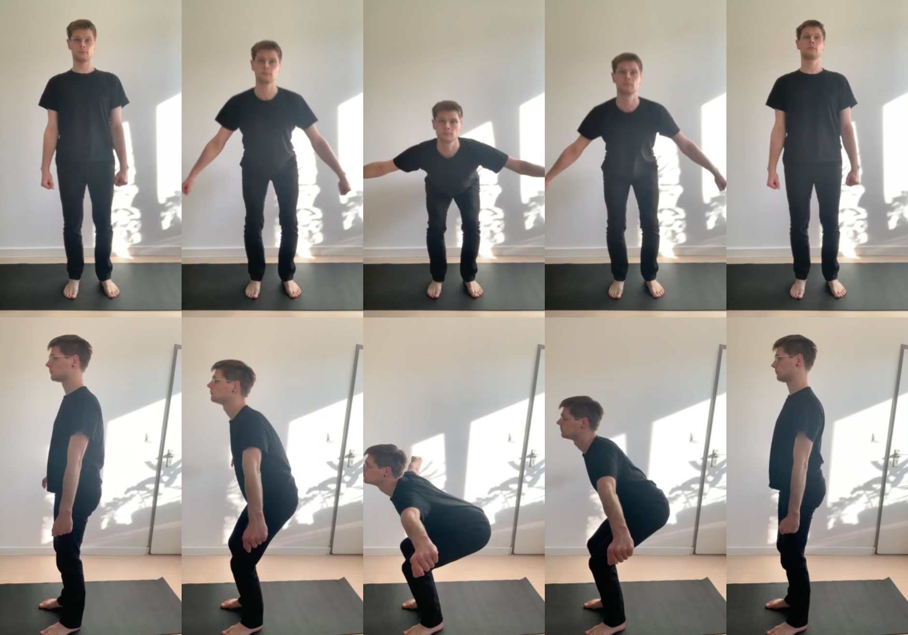

# Exercise: Squat Arm Abduction

!> Status: Draft

The question of selecting the movement is based on if it’s suitable to evaluate the range of functionality of the proposed system. The evaluation the pose evaluation needs to be as objective as possible - which is actually not that easy. But there are some globally accepted rules that are getting applied accordingly to the exercise.

For my master thesis, I want to evaluate a full body movement during a fitness activity which includes weight / muscle activation exercises. Thus, the exercise I need has to cover the main body joint areas:
- shoulder, 
- back, 
- abdomen, 
- hip, 
- knee and 
- ankle. 

Exercises for these are usually squats and arm abduction movements.
My movement is therefore a squat with lateral arm abductions which you can see in the attached image.

The ruleset for this movement is summarized as the following:
Frontal aspects
- Head vertically in line
- Arm elevation symmetrical into horizontal line
- Elbow straight
- Wrist straight and in line with elbow
- Kneecap always in line with the feet, also during movement (preventing X/O legs)
- Feet slightly rotated outwards (depending on how wide the feet are, based on the hip bone)

Sagital aspects
- Neck slightly bend (natural 20 degree bending)
- Backbone straight
- Hip rotated up to max 100 degree
- Knee joint rotated to 90 degree